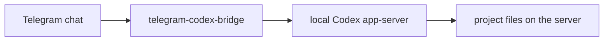

# telegram-codex-bridge

[](https://github.com/InDreamer/telegram-codex-bridge/actions/workflows/ci.yml)
[](https://github.com/InDreamer/telegram-codex-bridge/stargazers)

Turn Telegram into a remote control for the Codex installation that already runs on your server.

This bridge exists for one simple reason: Codex on a VPS is useful, but using it from a phone through a raw terminal is awful. `telegram-codex-bridge` gives you a Telegram-native control surface without pretending to be a second Codex runtime, a second sandbox, or a provider-management layer.



## Why This Project Is Interesting

- project-aware session startup from Telegram instead of blind remote execution
- compact runtime cards plus `/inspect` and `/where` instead of terminal spam
- bridge-owned approval and questionnaire UX when Codex asks for input
- multi-session flow with archive, unarchive, rename, and switching
- Telegram photo upload mapped into `localImage` input
- optional Telegram voice-message transcription
- `/review`, `/rollback`, `/compact`, model selection, plugin/app/MCP surfaces where the current Codex CLI supports them
- one-line GitHub install scripts for both the bridge and the bundled Codex setup skill

## What It Is

- Telegram is the control surface
- Codex remains the execution engine
- the bridge runs as a VPS or always-on host service
- the bridge adapts Telegram UX to a high-trust Codex runtime

## What It Is Not

- not a second Codex environment
- not a second permission system
- not a provider-management layer
- not a multi-user team chat bot
- not a fake terminal stuffed into Telegram

## Fastest Install Paths

### Option 1: Let Codex Set It Up

Install the bundled Codex skill:

```bash
curl -fsSL https://raw.githubusercontent.com/InDreamer/telegram-codex-bridge/master/scripts/install-skill-from-github.sh | bash
```

Then tell Codex:

```text
Use $telegram-codex-linker to set up my Telegram bridge.
```

This is the cleanest install path. The skill handles bridge setup, repair, token collection, authorization, and verification, and only interrupts you for the parts a bot cannot do for you.

### Option 2: Install The Bridge Directly

```bash
curl -fsSL https://raw.githubusercontent.com/InDreamer/telegram-codex-bridge/master/scripts/install-from-github.sh | bash -s -- --telegram-token "<BOT_TOKEN>" --project-scan-roots "$HOME/projects:$HOME/work"
```

## Requirements

- an always-on Linux or macOS machine
- an existing Codex installation on that machine
- a Telegram bot token
- Node `>=25.0.0` if you build from source

## Typical Telegram Flow

1. Run `/new` and choose the project instead of silently guessing a worktree.
2. Send a task, or send a photo/voice message when that fits the job.
3. Watch the runtime card and use `/inspect` or `/interrupt` when needed.
4. Use `/sessions`, `/archive`, `/review`, `/rollback`, `/compact`, `/model`, `/plugins`, `/apps`, or `/mcp` as the task demands.

## Development

```bash
npm ci
npm run check
npm run test
npm run build
```

For local development:

```bash
npm run dev
```

CLI entrypoint:

```bash
ctb
```

## Documentation And Agent Routing

Use the smallest relevant entrypoint.

### For coding agents

Default traversal is:

1. `AGENTS.md`
2. exactly one domain agent:
   - `docs/AGENTS.md`
   - `src/AGENTS.md`
   - `scripts/AGENTS.md`
   - `skills/AGENTS.md`
3. exactly one leaf doc or one narrow source file

This keeps the index shallow and supports progressive disclosure.

### For humans

Start with one of these entry points:

- `docs/README.md` — human-readable three-tier doc map
- `docs/product/v1-scope.md` — product boundary and trust model
- `docs/architecture/current-code-organization.md` — code-derived ownership map
- `docs/operations/install-and-admin.md` — operator/admin reference
- `docs/generated/current-snapshot.md` — volatile versions and size/count facts
- `docs/research/codex-app-server-authoritative-reference.md` — Codex protocol reference

### Source classes

Keep these source classes separate in reasoning and answers:

- **current truth**: `docs/product/`, `docs/architecture/`, `docs/operations/`, `docs/generated/current-snapshot.md`
- **current implementation**: `src/`
- **protocol evidence**: `docs/research/`
- **planning and history**: `docs/roadmap/`, `docs/future/`, `docs/plans/`, `docs/archive/`

Do not treat planning/history as proof that behavior is already shipped.
Do not treat protocol capability as proof that Telegram UX already exposes it.

## Current Status

The project is in active development.

The docs and agents are organized to support gradual retrieval rather than whole-repo preload:

- root agent chooses a domain
- domain agent chooses one leaf source
- deeper expansion happens only when the task proves it is necessary
