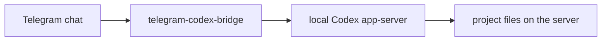

# Telegram Codex Bridge

[](https://github.com/InDreamer/telegram-codex-bridge/actions/workflows/ci.yml)
[](https://github.com/InDreamer/telegram-codex-bridge/stargazers)
[](https://nodejs.org/)
[](https://telegram.org/)

Use Codex from Telegram with project-aware sessions, approval cards, runtime visibility, and a self-hosted install path that does not pretend your phone is a terminal.

`telegram-codex-bridge` is for people who already run Codex on a VPS, workstation, or always-on machine and want a cleaner remote control surface from their phone.



## Why This Exists

Running Codex remotely is useful. Driving it from a raw terminal on a phone is not.

This project gives Codex a Telegram-native control plane:

- choose the project before the first real task instead of silently guessing a directory
- monitor progress with compact runtime cards instead of terminal spam
- answer approvals and questionnaires with bridge-owned Telegram UI
- switch, archive, rename, and inspect sessions without dropping into SSH
- send text, photos, and optional voice input from the same chat

## Highlights

- project-aware session startup with explicit project selection
- one authorized Telegram user, private-chat-first trust model
- `/inspect`, `/where`, `/status`, `/interrupt`, `/review`, `/rollback`, `/compact`, `/model`, `/plugins`, `/apps`, `/mcp`
- photo upload mapped into `localImage` input
- optional voice-message transcription
- Linux and macOS install/admin surface with `ctb install`, `ctb status`, `ctb doctor`, and service management
- runtime state, recovery, and diagnostics designed for long-lived operation

## What It Is

- Telegram is the control surface
- Codex remains the execution engine
- the bridge reuses the Codex environment already on your machine
- the bridge is optimized for a high-trust, self-hosted setup

## What It Is Not

- not a second Codex environment
- not a second permission system
- not a provider-management layer
- not a multi-user team bot
- not a fake terminal squeezed into Telegram

## Fastest Install

### Option 1: Let Codex Set It Up

Install the bundled skill:

```bash
curl -fsSL https://raw.githubusercontent.com/InDreamer/telegram-codex-bridge/master/scripts/install-skill-from-github.sh | bash
```

Then tell Codex:

```text
Use $telegram-codex-linker to set up my Telegram bridge.
```

This is the cleanest path. The skill handles bridge install, repair, token collection, authorization, and verification, and only stops for the parts that require you.

### Option 2: Install The Bridge Directly

```bash
curl -fsSL https://raw.githubusercontent.com/InDreamer/telegram-codex-bridge/master/scripts/install-from-github.sh | bash -s -- --telegram-token "<BOT_TOKEN>" --project-scan-roots "$HOME/projects:$HOME/work"
```

## Who This Is For

- you already use Codex on a server, desktop, or always-on machine
- you want a cleaner phone workflow than SSH plus tmux
- you prefer self-hosted tools and explicit operator control
- you are okay with Telegram being the control plane into a high-trust runtime

## Typical Telegram Flow

1. Run `/new` and choose the project.
2. Send a task, a photo, or a voice message.
3. Watch the runtime card and use `/inspect` or `/interrupt` when needed.
4. Use `/sessions`, `/review`, `/rollback`, `/compact`, `/model`, `/plugins`, `/apps`, or `/mcp` as the task evolves.

## Why It Feels Reliable

- explicit project selection before work starts
- service-oriented install flow instead of ad hoc shell sessions
- persistent SQLite-backed state and recovery behavior
- runtime diagnostics for operators, not just end users
- docs split into product, architecture, operations, and research so behavior is easier to verify

## Requirements

- Linux or macOS
- an existing Codex installation on that machine
- a Telegram bot token
- Node `>=25.0.0` if you build from source

## Development

```bash
npm ci
npm run check
npm run test
npm run build
```

For local development:

```bash
npm run dev
```

CLI entrypoint:

```bash
ctb
```

## Documentation

If you are evaluating the project:

- [`docs/product/v1-scope.md`](docs/product/v1-scope.md) for product boundary and trust model
- [`docs/operations/install-and-admin.md`](docs/operations/install-and-admin.md) for install and admin flow
- [`docs/architecture/runtime-and-state.md`](docs/architecture/runtime-and-state.md) for lifecycle, state, and recovery

If you are a coding agent:

1. `AGENTS.md`
2. exactly one domain agent
3. exactly one leaf doc or one narrow source file

The repo is intentionally documented for shallow, incremental retrieval instead of whole-repo preload.

## Contributing

Read [`CONTRIBUTING.md`](CONTRIBUTING.md), keep the scope tight, and update the matching docs when behavior changes.

## If This Is Useful

Star the repo, try it on a real Codex host, and open an issue if the install flow or Telegram UX still feels rough.
