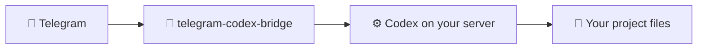

<h1 align="center">telegram-codex-bridge</h1>

<p align="center">
  <strong>Control Codex from Telegram. No terminal. No laptop. Just your phone.</strong>
</p>

<p align="center">
  <a href="https://github.com/InDreamer/telegram-codex-bridge/actions/workflows/ci.yml"></a>
  <a href="https://github.com/InDreamer/telegram-codex-bridge/stargazers"></a>
  <a href="https://github.com/InDreamer/telegram-codex-bridge/releases"></a>
  = 25">
  
</p>

---

## The Problem

Codex on a VPS is powerful. But reaching it from your phone through a raw SSH session is awful — no project awareness, no structured feedback, no approval flow. Just a wall of text in a tiny terminal.

## The Solution

`telegram-codex-bridge` turns Telegram into a **native control surface** for your existing Codex installation. It's not a second Codex, not a chatbot wrapper — it's a proper remote control.



## Quick Install

### Recommended: Let Codex set it up

```bash
curl -fsSL https://raw.githubusercontent.com/InDreamer/telegram-codex-bridge/master/scripts/install-skill-from-github.sh | bash
```

Then tell Codex:

```
Use $telegram-codex-linker to set up my Telegram bridge.
```

The skill handles everything — bridge install, token collection, authorization, and verification.

### Alternative: Direct install

```bash
curl -fsSL https://raw.githubusercontent.com/InDreamer/telegram-codex-bridge/master/scripts/install-from-github.sh | bash -s -- \
  --telegram-token "<YOUR_BOT_TOKEN>" \
  --project-scan-roots "$HOME/projects:$HOME/work"
```

### Requirements

- An always-on Linux or macOS machine
- An existing [Codex](https://codex.new) installation
- A Telegram bot token (from [@BotFather](https://t.me/BotFather))
- Node >= 25 (if building from source)

## Who This Is For

- You already run Codex on a server, desktop, or always-on machine
- You want a cleaner phone workflow than SSH plus tmux
- You prefer self-hosted tools and explicit operator control
- You are okay with Telegram being the control plane into a high-trust runtime

## What You Get

### Project-Aware Sessions

Run `/new` and **choose your project** before starting. No blind execution, no guessing which directory you're in.

### Runtime Visibility

Watch task progress through clean **runtime cards** instead of terminal noise. Use `/inspect` for details, `/where` for current location.

### Approval Flows in Telegram

When Codex needs your input — approval, questionnaire, or a decision — the bridge renders it as native Telegram UI. No raw protocol messages.

### Rich Input

- Send a **photo** and it maps directly to Codex image input
- Send a **voice message** and it gets transcribed into text
- Full support for skills, mentions, and local images

### Session Management

Archive, unarchive, rename, pin, and switch between sessions — organized like Telegram chats but linked to your server projects.

### Full Command Surface

| Command | What it does |
|---------|-------------|
| `/new` | Start a new session with project picker |
| `/sessions` | List and switch between sessions |
| `/inspect` | Detailed view of current activity |
| `/interrupt` | Stop a running task |
| `/review` | Review changes in current session |
| `/rollback` | Undo changes |
| `/model` | Switch models and reasoning effort |
| `/plan` | Toggle plan mode |
| `/compact` | Compact conversation context |
| `/browse` | Read-only file browser |
| `/plugins` `/apps` `/mcp` | Manage extensions |

## How It Works

```
You (Telegram) → bridge (on your server) → Codex app-server → your project files
```

- **Telegram** is the control surface (your phone)
- **The bridge** translates between Telegram UX and Codex protocol
- **Codex** remains the execution engine
- Everything runs on **your machine** — self-hosted, single-user, high-trust

## What It Is Not

- Not a second Codex — it controls your existing one
- Not a multi-user team bot — it's a personal remote control
- Not a fake terminal in Telegram — it's a proper native UI
- Not a provider layer — your Codex config handles that

## After Install

The `ctb` CLI manages your bridge:

```bash
ctb service run         # Start the bridge
ctb status              # Health check
ctb authorize pending   # Bind your Telegram account (one-time)
ctb doctor              # Run diagnostics
ctb update              # Self-update
```

Service management is built in — systemd on Linux, LaunchAgent on macOS.

## Development

```bash
npm ci                  # Install dependencies
npm run check           # Type-check
npm run test            # Run tests
npm run build           # Build
npm run dev             # Dev mode with hot reload
```

## Documentation

For detailed docs, start here:

- [`docs/README.md`](docs/README.md) — documentation map
- [`docs/product/v1-scope.md`](docs/product/v1-scope.md) — product boundary and trust model
- [`docs/operations/install-and-admin.md`](docs/operations/install-and-admin.md) — admin reference
- [`docs/architecture/current-code-organization.md`](docs/architecture/current-code-organization.md) — code organization

For coding agents, see [`AGENTS.md`](AGENTS.md).

## Contributing

Read [`CONTRIBUTING.md`](CONTRIBUTING.md), keep the scope tight, and update the matching docs when behavior changes.

## If This Is Useful

Star the repo, try it on a real Codex host, and [open an issue](https://github.com/InDreamer/telegram-codex-bridge/issues) if the install flow or Telegram UX still feels rough.

---

<p align="center">
  <strong>Built by <a href="https://github.com/InDreamer">VainProphet</a></strong> — a prophet who ships tools, not predictions.
</p>
